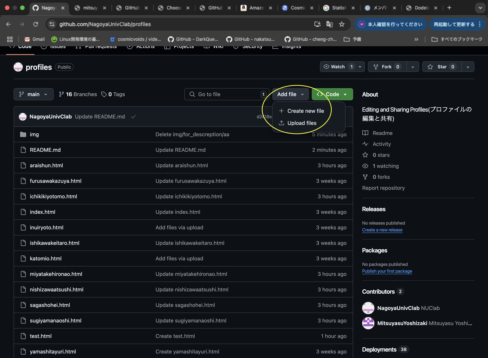
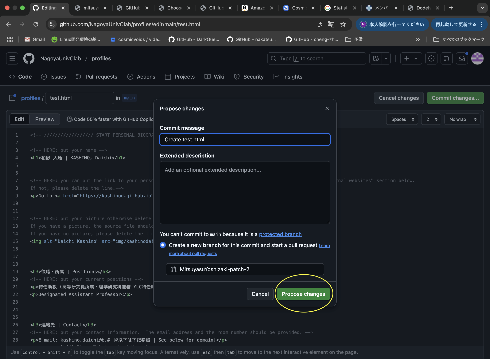
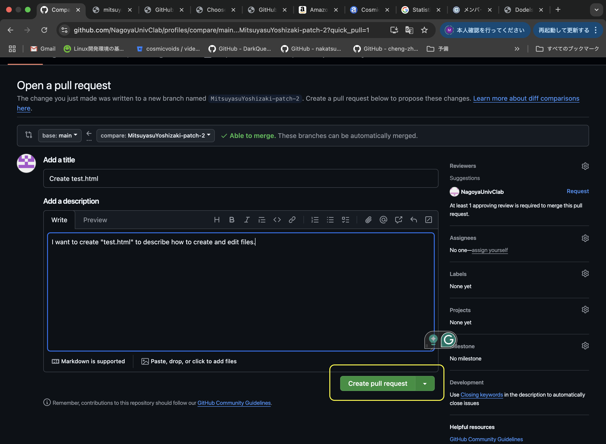

# profiles
このリポジトリはC研のホームページのメンバーにある個人のhtmlファイルの管理、編集を目的として作成されています。
このリポジトリにより、このリポジトリ内のファイルを編集し、web係から変更を承認されることで、C研HPでの個人ページの表示に反映されます。

※反映には、web係からの承認後、少し時間がかかります。

---------------------------------------------------------

<!--Editing and Sharing Profiles(プロファイルの編集と共有)-->
This repository is created to manage and edit individual HTML files listed under the "Members" section of the C-Lab homepage.
By using this repository, you can edit your personal page, and once the changes are approved by the web team, they will be reflected on the C-Lab website.

※ Please note that updates on the homepage may take some time after the web team's approval.

## <ルール(Rules)>
このレポジトリで、自分のhtmlファイルをyourfullname.htmlの中のコードを全てコピーし、新たなファイルにペーストしてから作成してください。
htmlファイルの変更は、該当ファイル名をクリックして、右上に鉛筆マークをクリックすると、コードを書き換えることができます。
しかしファイルの作成・変更にはpull requestとなり、web係によって認証され次第、実際にファイルが作成・変更されます。
具体的な編集方法は以下にまとめています。

---------------------------------------------------------

To create your personal HTML file, copy the entire content of the yourfullname.html template and paste it into a new file.
To edit your HTML file, click the file name and then click the pencil icon (✏️) in the upper right corner. This allows you to modify the code directly.

However, any creation or modification of files must go through a pull request, and will only be finalized once approved by the web team.
Detailed editing instructions are provided below.

### <ファイルの作成方法(How to make files)>
この操作で使うタグは黄色の実線で囲まれた３つのタグです。
"Add file"をクリックして、"Create new file"をクリックすると、新しいファイルを作成できます。
もし、画像やローカルで編集したファイルをアップロードしたい場合には"Upload files"をクリックして、当該ファイルをgithubの画面内にドラッグするか、ファイルを選択してください。

---------------------------------------------------------

Use the three buttons outlined in yellow in Figure 1 for this operation.

Click "Add file" and then "Create new file" to create a new file.

To upload images or local files, click "Upload files" and either drag the files into the browser or use the file selector.

Figure 1. ファイルの追加に使うタグ(Buttons used to add a file)

### <ファイルの編集方法(How to Edit a Fil)>
1. 編集の開始(Start Editing)

図2にある黄色の実線で囲んだタグをクリックすると編集が始まります。右上に"Commit changes"と書かれた緑のタグがあれば、編集用の画面が開かれています。

---------------------------------------------------------

Click the button outlined in yellow in Figure 2 to begin editing.
If you see the green button labeled "Commit changes" in the top right, you are in the edit mode.

Figure 2. 鉛筆マークの位置(Location of the pencil icon)

2. 変更の提案(Propose Changes)

編集が終わったら、"Commit changes"という緑色のタグをクリックします。その後、図3のような黄色の実線内の"Propose changes"をクリックすると、管理者にファイルの変更を提案することができます。
<!--そして上の小さなセルには、どのファイルを編集したか(例：Update _yourname_.html)を記入してください。-->

---------------------------------------------------------
After finishing your edits, click the green button "Commit changes", and then click "Propose changes", outlined in yellow in Figure 3, to suggest your updates to the administrator.

Figure 3. ファイルの変更についての提案に使うタグ(Button used to propose changes)

3. 編集の終了(Pull requestの生成)(Finalize Edits (Creating a Pull Request))

本来なら手順2までで編集が完了しますが、ここでは共同のリポジトリでのファイルの追加・編集を行うので、管理者に認証された場合にのみ編集が反映されるようなシステムになっています。
このシステムのために、Pull requestを生成する必要があります。Pull requestは図4のような黄色の実線内の"Create pull request"をクリックすることで、生成することができます。
Pull requestが認証されると、変更点が反映され、個人ページが変わるため、操作は以上になります。お疲れ様でした。

---------------------------------------------------------

Although your edit is technically complete after Step 2, since this is a shared repository, changes will only take effect once they are approved by an administrator.
To enable this process, you need to create a Pull Request. Click the button "Create pull request" (outlined in yellow in Figure 4) to do so.

Once the pull request is approved, your personal page will be updated accordingly.
That’s all for the editing process—well done!

Figure 4. Pull requestの作成に使うタグ(Button used to create a Pull Request)
<!---->
# 改善点があれば、是非とも教えてください!

わからない手順や予期せぬことが生じた場合には、web係までご相談ください。

---------------------------------------------------------

# Let us know if you have any suggestions for improvement!
If you run into any issues or have questions, please feel free to reach out to the web team.

## <メモ>
HPなどを新たなタブに表示する方法(To make a hyperlink open in a new tab, use the following HTML format): <a href="参照したいURL" **target="_blank" rel="noopener noreferrer"**>(青文字にしたい部分)</a>
